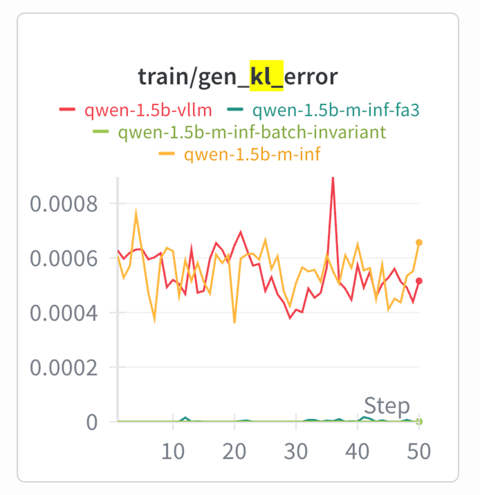
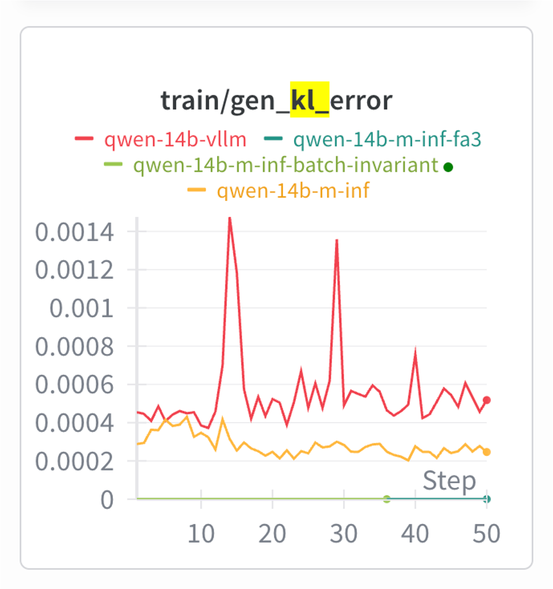
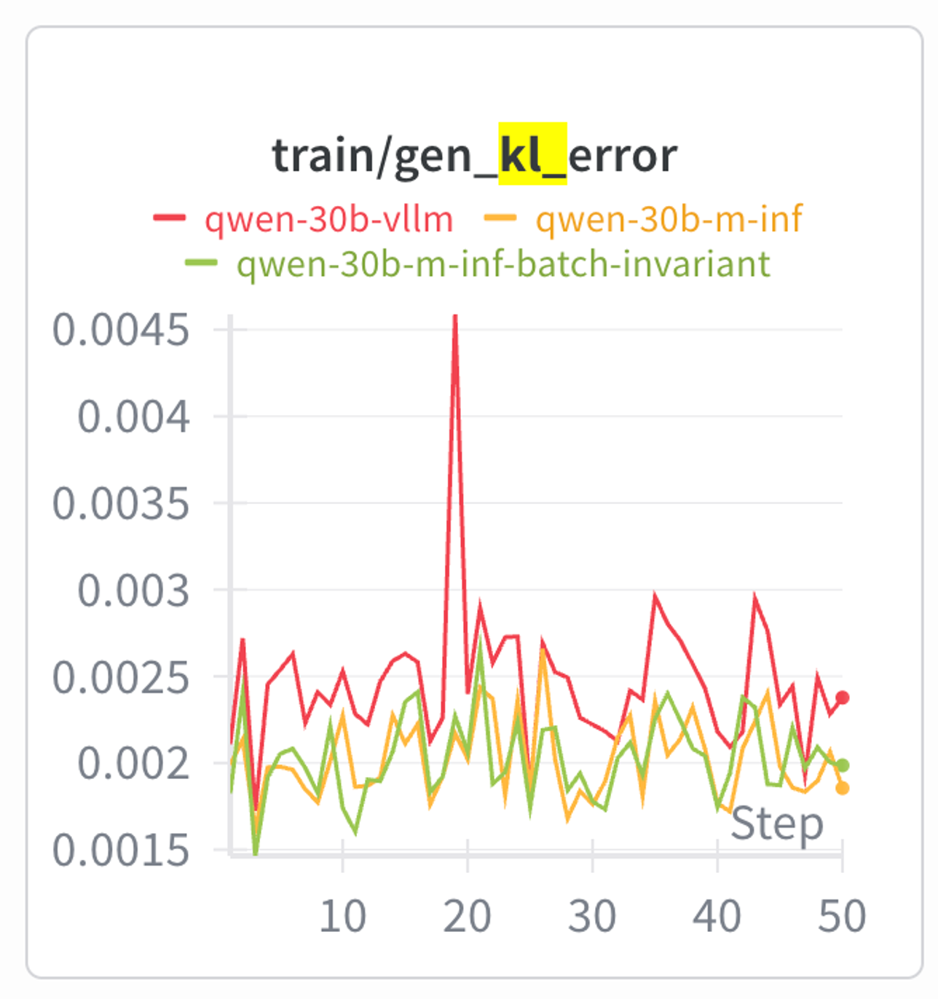

# Megatron-Inference True On-Policy Study

True on-policy RL training using Megatron-Inference to minimize training-generation mismatch (`gen_kl_error` -> 0).

**Status:** Dense models (Qwen2.5-1.5B, 14B) achieve ~0 gen_kl_error with M-Inf + batch invariant mode. MoE (Qwen3-30B-A3B) still in progress -- requires Grouped GEMM determinism + MoE Router Replay.

## Setup

```bash
# 1. Clone the RL repo (branch: jinzex/m-inf-true-on-policy)
git clone -b jinzex/m-inf-true-on-policy git@github.com:jinzex/RL.git
cd RL && git submodule update --init --recursive

# 2. Download the container (one-time)
enroot import --output nemo_rl_v0.5.0.sqsh 'docker://nvcr.io#nvidia/nemo-rl:v0.5.0'
# This creates nemo_rl_v0.5.0.sqsh in the current directory.
# Move it to your preferred location and update CONTAINER_IMAGE in the scripts.
#
# Note: The scripts mount RL_DIR onto /opt/nemo-rl inside the container,
# overlaying the container's built-in NemoRL with the branch's code changes
# (FA3 auto-install, batch_invariant_mode support, etc.).

# 3. Create .env with your config
cp .env.template .env
# Edit .env: set HF_TOKEN, HF_HOME, WANDB_API_KEY, WANDB_PROJECT

# 4. Update paths in the scripts
# Edit RL_DIR and CONTAINER_IMAGE at the top of each run_qwen*_study.sh
```

## Run

```bash
# Qwen2.5-1.5B (1 node, TP=1)
sbatch --export=MODE=vllm        run_qwen1.5b_study.sh
sbatch --export=MODE=m-inf-fa3   run_qwen1.5b_study.sh

# Qwen2.5-14B (1 node, TP=2)
sbatch --export=MODE=vllm        run_qwen14b_study.sh
sbatch --export=MODE=m-inf-fa3   run_qwen14b_study.sh

# Qwen3-30B-A3B (2 nodes, TP=4, EP=16)
sbatch --export=MODE=vllm        run_qwen30b_study.sh
sbatch --export=MODE=m-inf       run_qwen30b_study.sh
```

## Results

`train/gen_kl_error` across 50 GRPO steps:

| Qwen2.5-1.5B | Qwen2.5-14B | Qwen3-30B-A3B |
|:---:|:---:|:---:|
|  |  |  |
| ✅ | ✅ | 🚧 |
| H100 GPU=8 | H100 GPU=8 | H100 GPU=16 |
| TP=1 MBS=4 GBS=16 | TP=2 MBS=2 GBS=16 | TP=4 EP=16 MBS=1 GBS=16 |

🚧 WIP to add router replay + more deterministic mode (GroupedGEMM is not batch invariant yet)
